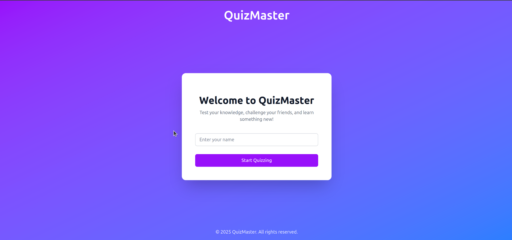

# Quiz Based Realtime App

## Overview

This project is a modern, real-time quiz application developed using the latest web technologies. The application allows users to participate in quizzes, submit answers in real-time, and view the leaderboard dynamically, leveraging the power of WebSockets for seamless real-time interactions. The app is designed with clean, scalable architecture and ensures high code quality through TypeScript and class-based implementation.

## Key Features

1. **Real-Time Quiz Gameplay**:

   - Users can join a quiz session in real-time.
   - Questions are displayed dynamically, and answers are submitted with real-time updates using WebSockets.

2. **Dynamic Leaderboard**:

   - Displays the live scores of participants.
   - Animates and centers upon quiz completion, providing a smooth user experience.

3. **Clean Architecture**:

   - Developed using TypeScript to ensure type safety and scalability.
   - Utilizes class-based implementation for better modularity and reusability.

4. **Modern Frontend**:

   - Built with Vite for fast development and optimized builds.
   - Context API is used for state management to handle socket connections and shared quiz data efficiently.

5. **Responsive and Interactive Design**:

   - Fully responsive design, ensuring a seamless experience across devices.
   - Enhanced animations, transitions, and visual feedback for a polished UI.

6. **Code Quality**:

   - TypeScript ensures strict type checking.
   - Well-documented codebase with reusable components.
   - Scalable project structure following best practices.

## Tech Stack

- **Frontend Framework**: React (with TypeScript)
- **Build Tool**: Vite (optimized for speed and performance)
- **Real-Time Communication**: Socket.IO
- **State Management**: Context API
- **Styling**: Tailwind CSS (for modern, responsive design)
- **Backend**: Node.js (Socket.IO server integration)

## Project Structure

```
├── src
│   ├── components       # Reusable UI components
│   │   ├── UserJoinedToggle.tsx
│   │   ├── LeaderBoard.tsx
│   │   └── QuizPlay.tsx
│   ├── context          # Context API setup
│   │   └── socketContext.ts
│   ├── utils            # Utility functions and socket client setup
│   ├── App.tsx          # Root application file
│   └── main.tsx         # Entry point
├── public               # Static assets
├── package.json         # Project dependencies
├── tsconfig.json        # TypeScript configuration
└── vite.config.ts       # Vite configuration
```

## Installation and Setup

### Prerequisites

- Node.js (v16+ recommended)
- npm or yarn

### Steps

1. Clone the repository:
   ```bash
   git clone https://github.com/AQIB-NAWAB/Real-Time-Quiz-App
   ```
2. Install dependencies:
   ```bash
   cd client 
   npm install
   # same for server 
   cd server
   npm install
   ```
3. Start the development server:
   ```bash
   npm run dev
   # same for server 
   npm run dev
   ```
4. Open your browser and navigate to `http://localhost:5173`.

## Usage

1. Start the backend server (Socket.IO).
2. Open the app in a browser.
3. Select or join a quiz.
4. Answer questions in real-time and see your score update on the leaderboard.
5. Complete the quiz to view the final results.

## Scripts

- `npm run dev`: Start the development server.
- `npm run build`: Build the app for production.

## Features Walkthrough

### 1. Quiz Gameplay

- Questions are displayed sequentially.
- Users can select and submit answers.
- The app ensures seamless transitions between questions.

### 2. Leaderboard

- Displays participants’ rankings and scores in real-time.
- Fully responsive and animated for better user engagement.

### 3. Socket.IO Integration

- Handles real-time communication between the client and server.
- Ensures low latency for smooth gameplay.

### 4. TypeScript and Code Quality

- Ensures type safety and reduces runtime errors.
- Modular and scalable code structure for future enhancements.

---

Happy quizzing! 🚀

